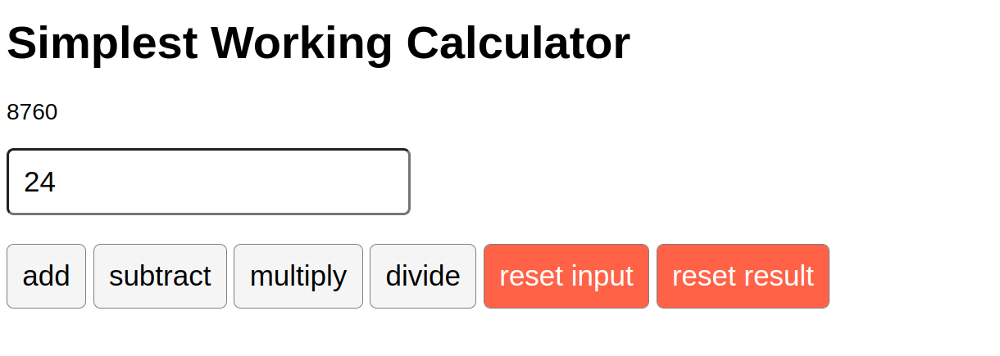

# 📜 Meta Front-End Developer Certificate

## 📝 Course 5: React basics

## ✍ Graded Assessment. Build a calculator app

### Instructions

The graded assessment requires you to complete a calculator in React. You will be provided with code snippets, and your task is to use these, plus any of your code to complete the calculator that can perform the four basic mathematical operations: addition, subtraction, multiplication, and division.

It will also have a single input button, which will accept user input (any number) and a total starting with a zero.

Once a user types into the input field, they will then have to update the total by pressing any of the four math operation buttons:

- addition

- subtraction

- multiplication

- division

Here's a diagram of the completed calculator app:

### Example of the calculator (img provided in the assignments)

### 🛠 Tools

 |Tool| Version|
 |----|--------|
 |HTML|5|
 |CSS|3.10.4|
 |JavaScript| ES6|
 |React|18.2.0|
 |Visual Studio Code| 1.75.0|
 |Git|2.36.1|
 |Github repository| |
 |Netlify| |

### 🔑 License

- [MIT License](LICENSE)

### 🧮 This project was deployed on Netlify too
